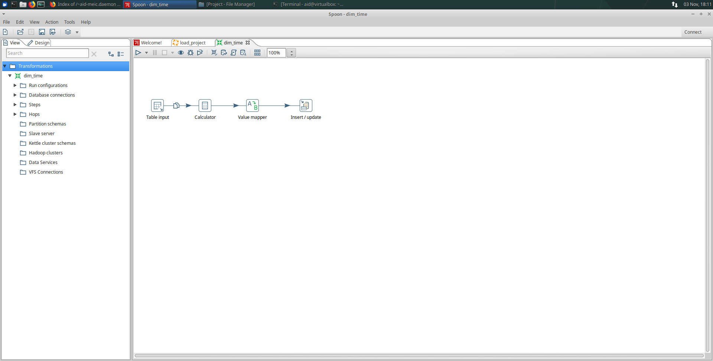
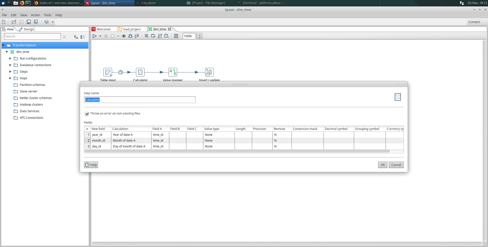
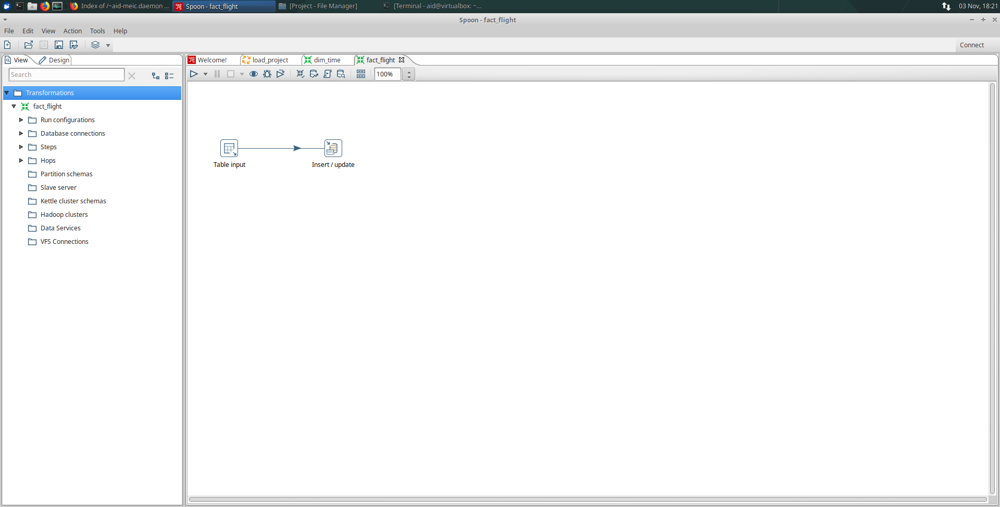
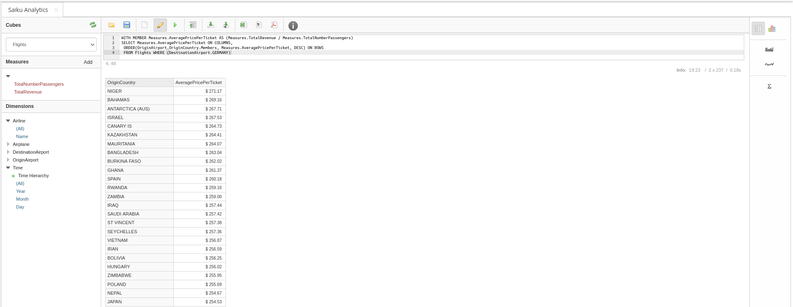

# AID-Project

### Group 39,   89436 - Diogo Moniz Pacheco,  105180 - Roméo Paul-Loup Axel Legoupil

### 1. Creation of the airports database

Once connected to the MySQL server, we execute the command to create the provided airport database: `source airports.sql`

In airport database, we create a view called <strong>moreperformance</strong> to use in the fact_flight transformation to be faster.


Here is the query to <strong>moreperformance</strong>:
```
create or replace view moreperformance(flight_id, passengernumber, total_receive, airline_id, airplane_id, from, to, departure, arrival) as select b.flight_id, count(passenger_id) as passengernumber, sum(price) as total_receive, airline_id, airplane_id, from, to, departure, arrival from flight as f, booking as b where f.flight_id = b.flight_id group by b.flight_id order by b.flight_id;
```


### 2. Creation of the airports data warehouse

We create 4 dimension tables and 1 fact table into the data warehouse airports_dw :
- dim_airline : Airline dimension
- dim_airplane : Airplane dimension
- dim_airport : Airport dimension for origin and destination
- dim_time : Time dimension for departure and arrival
- fact_flight : Fact table for flight

<br><br>

Here is the code:

```
DROP DATABASE IF EXISTS airports_dw;

CREATE DATABASE airports_dw;

USE airports_dw;

CREATE TABLE dim_airline (
    AIRLINE_ID INT,
    AIRLINE_NAME VARCHAR(255),
    PRIMARY KEY (AIRLINE_ID)
);

CREATE TABLE dim_airplane (
    AIRPLANE_ID INT,
    AIRPLANE_TYPE VARCHAR(255),
    PRIMARY KEY (AIRPLANE_ID)
);

CREATE TABLE dim_airport(
    AIRPORT_ID INT,
    AIRPORT_NAME VARCHAR(255),
    CITY VARCHAR(255),
    COUNTRY VARCHAR(255),
    PRIMARY KEY (AIRPORT_ID)
);

CREATE TABLE dim_time(
    TIME_ID DATETIME,
    YEAR_ID INT,
    MONTH_ID INT,
    MONTH_NAME VARCHAR(255),
    DAY_ID INT,
    PRIMARY KEY (TIME_ID)
);

CREATE TABLE fact_flight(
    FLIGHT_ID INT,
    PASSENGERS_NUMBER INT,
    RECEIVE_TOTAL DOUBLE,
    AIRLINE_ID INT,
    AIRPLANE_ID INT,
    ORIGIN_AIRPORT_ID INT,
    DESTINATION_AIRPORT_ID INT,
    DEPARTURE_TIME_ID DATETIME,
    ARRIVAL_TIME_ID DATETIME,
    PRIMARY KEY (FLIGHT_ID),
    FOREIGN KEY (AIRLINE_ID) REFERENCES dim_airline (AIRLINE_ID),
    FOREIGN KEY (AIRPLANE_ID) REFERENCES dim_airplane (AIRPLANE_ID),
    FOREIGN KEY (ORIGIN_AIRPORT_ID) REFERENCES dim_airport (AIRPORT_ID),
    FOREIGN KEY (DESTINATION_AIRPORT_ID) REFERENCES dim_airport (AIRPORT_ID),
    FOREIGN KEY (DEPARTURE_TIME_ID) REFERENCES dim_time (TIME_ID),
    FOREIGN KEY (ARRIVAL_TIME_ID) REFERENCES dim_time (TIME_ID)
);
```
Then to create the airports data warehouse we execute the following command: `source airports_dw.sql`

<br><br><br><br>

### 3. Transformations developed in PDI

#### Airline dimension

*Figure 1 - dim_airline entire transformation*
<br><br>

*Figure 2 - dim_airline table input window*
<br><br>

*Figure 3 - dim_airline insert/update window*
<br>

#### Airplane dimension

*Figure 4 - dim_airplane entire transformation*
<br><br>

*Figure 5 - dim_airplane table input window*
<br><br>

*Figure 6 - dim_airplane select values window*
<br><br>

*Figure 7 - dim_airplane table input 2 window*
<br><br>

*Figure 8 - dim_airplane select values 2 window*
<br><br>

*Figure 9 - dim_airplane join rows window*
<br><br>

*Figure 10 - dim_airplane insert/update window*
<br><br><br><br><br><br><br><br>

#### Airport dimension

*Figure 11 - dim_airport entire transformation*
<br><br>

*Figure 12 - dim_airport input table window*
<br><br>

*Figure 13 - dim_airport insert/update window*
<br><br>

#### Time dimension

*Figure 14 - dim_time entire transformation*
<br><br>

*Figure 15 - dim_time table input window (union between departures and arrivals)* 
<br><br>

*Figure 16 - dim_time calculator window*
<br><br>

*Figure 17 - dim_time value mapper window*
<br><br>

*Figure 18 - dim_time insert/update window*
<br><br><br><br><br><br><br><br><br><br><br><br>

#### Flight fact

*Figure 19 - fact_flight entire transformation*
<br><br>

*Figure 20 - fact_flight table input window (Here we use the view moreperformance to be faster in the largest databases)*
<br><br>

*Figure 21 - fact_flight insert/update window*

#### Final Job

*Figure 22 - Complete job*
<br><br><br><br><br><br><br><br><br><br>

### 4. XML Code for the cube definition

```
<Schema name="airports_dw">
  <Cube name="Flights" visible="true" cache="true" enabled="true">
    <Table name="fact_flight">
    </Table>
    <Dimension type="StandardDimension" visible="true" foreignKey="AIRLINE_ID" highCardinality="false" name="Airline">
      <Hierarchy name="Airline Hierarchy" visible="true" hasAll="true" allMemberName="All Arlines" primaryKey="AIRLINE_ID">
        <Table name="dim_airline">
        </Table>
        <Level name="Name" visible="true" column="AIRLINE_NAME" type="String" uniqueMembers="false" levelType="Regular" hideMemberIf="Never">
        </Level>
      </Hierarchy>
    </Dimension>
    <Dimension type="StandardDimension" visible="true" foreignKey="ORIGIN_AIRPORT_ID" highCardinality="false" name="OriginAirport">
      <Hierarchy name="Origin Airport Hierarchy" visible="true" hasAll="true" allMemberName="All Origin Airports" primaryKey="AIRPORT_ID">
        <Table name="dim_airport">
        </Table>
        <Level name="OriginCountry" visible="true" column="COUNTRY" type="String" uniqueMembers="false" levelType="Regular" hideMemberIf="Never">
        </Level>
        <Level name="OriginCity" visible="true" column="CITY" type="String" uniqueMembers="false" levelType="Regular" hideMemberIf="Never">
        </Level>
	<Level name="OriginName" visible="true" column="AIRPORT_NAME" type="String" uniqueMembers="false" levelType="Regular" hideMemberIf="Never">
        </Level>
      </Hierarchy>
    </Dimension>
    <Dimension type="StandardDimension" visible="true" foreignKey="DESTINATION_AIRPORT_ID" highCardinality="false" name="DestinationAirport">
      <Hierarchy name="Destination Airport Hierarchy" visible="true" hasAll="true" allMemberName="All Destination Airports" primaryKey="AIRPORT_ID">
        <Table name="dim_airport">
        </Table>
        <Level name="DestinationCountry" visible="true" column="COUNTRY" type="String" uniqueMembers="false" levelType="Regular" hideMemberIf="Never">
        </Level>
        <Level name="DestinationCity" visible="true" column="CITY" type="String" uniqueMembers="false" levelType="Regular" hideMemberIf="Never">
        </Level>
	<Level name="DestinationName" visible="true" column="AIRPORT_NAME" type="String" uniqueMembers="false" levelType="Regular" hideMemberIf="Never">
        </Level>
      </Hierarchy>
    </Dimension>
    <Dimension type="TimeDimension" visible="true" foreignKey="DEPARTURE_TIME_ID" highCardinality="false" name="Time">
      <Hierarchy name="Time Hierarchy" visible="true" hasAll="true" allMemberName="All Years" primaryKey="TIME_ID">
        <Table name="dim_time">
        </Table>
        <Level name="Year" visible="true" column="YEAR_ID" type="Integer" uniqueMembers="false" levelType="TimeYears" hideMemberIf="Never">
        </Level>
        <Level name="Month" visible="true" column="MONTH_NAME" ordinalColumn="MONTH_ID" type="String" uniqueMembers="false" levelType="TimeMonths" hideMemberIf="Never">
        </Level>
        <Level name="Day" visible="true" column="DAY_ID" type="Integer" uniqueMembers="false" levelType="TimeDays" hideMemberIf="Never">
        </Level>
      </Hierarchy>
    </Dimension>
    <Dimension type="StandardDimension" visible="true" foreignKey="AIRPLANE_ID" name="Airplane">
      <Hierarchy name="Airplane Hierarchy" visible="true" hasAll="true" allMemberName="All Airplanes" primaryKey="AIRPLANE_ID">
        <Table name="dim_airplane">
        </Table>
        <Level name="Type" visible="true" column="AIRPLANE_TYPE" type="String" uniqueMembers="false" levelType="Regular">
        </Level>
      </Hierarchy>
    </Dimension>
    <Measure name="TotalNumberPassengers" column="PASSENGERS_NUMBER" datatype="Integer" formatString="#,###" aggregator="sum" visible="true">
    </Measure>
    <Measure name="TotalRevenue" column="RECEIVE_TOTAL" datatype="Numeric" formatString="$ #,###.00" aggregator="sum" visible="true">
    </Measure>
  </Cube>
</Schema>
```

<br><br><br><br>

## 5. Database queries

Query1: passengers and revenue by airline and month (There is not a query because we don't use MDX mode)

<br>

Query2 code: Top5 airlines with better revenue
```
SELECT Measures.Members ON COLUMNS,
TOPCOUNT(Airline.[Name].Members, 5, Measures.TotalRevenue) ON ROWS
FROM Flights
```

<br>

Query3 code: Average price per passenger from other countries to germany
```
WITH MEMBER Measures.AveragePricePerTicket AS (Measures.TotalRevenue / Measures.TotalNumberPassengers)
SELECT Measures.AveragePricePerTicket ON COLUMNS,
ORDER(OriginAirport.OriginCountry.Members, Measures.AveragePricePerTicket, DESC) ON ROWS 
FROM Flights WHERE (DestinationAirport.GERMANY)
```

<br>

###  5.1. Small database (airports.sql) queries

<br>

*Figure 23 -  Query1: passengers and revenue by airline and month (small database - airports.sql)*

<br>

*Figure 24 - Query2: Top5 airlines with better revenue (small database - airports.sql)*

<br>

*Figure 25 - Query3: Average price per passenger from other countries to germany (small database - airports.sql)*

<br>

### 5.2. Larger database (airports-larger.sql) queries

<br>

*Figure 26 -  Query1: passengers and revenue by airline and month pt1 (larger database - airports-larger.sql)*

<br>

*Figure 27 -  Query1: passengers and revenue by airline and month pt2 (larger database - airports-larger.sql)*

<br>

*Figure 28 -  Query1: passengers and revenue by airline and month pt3 (larger database - airports-larger.sql)*

<br>

*Figure 29 -  Query1: passengers and revenue by airline and month pt4 (larger database - airports-larger.sql)*

<br>

*Figure 30 - Query2: Top5 airlines with better revenue (larger database - airports-larger.sql)*

<br>

*Figure 31 - Query3: Average price per passenger from other countries to germany pt1 (larger database - airports-larger.sql)*

<br>

*Figure 32 - Query3: Average price per passenger from other countries to germany pt2 (larger database - airports-larger.sql)*

<br>

*Figure 33 - Query3: Average price per passenger from other countries to germany pt3 (larger database - airports-larger.sql)*

<br>

*Figure 34 - Query3: Average price per passenger from other countries to germany pt4 (larger database - airports-larger.sql)*


